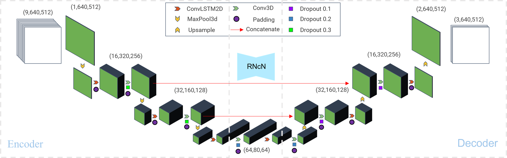

===============================
Instructional document
===============================
Abstract
--------
When attempting to enhance the incorporation of physical principles through coupling methods such as optical flow or others in deep learning, the resulting differences brought by these coupling strategies are often overlooked. Therefore, further verification is required to determine whether an end-to-end approach is indeed optimal for establishing such models. In this study, two classical model structures are employed to explore how different coupling strategies using the optical flow method affect prediction results along with corresponding attribution analysis. Some constructive comments and references will be presented for the next development of precipitation nowcasting models. Additionally, by considering geographical environmental variations across different regions in China, we evaluate the applicability of precipitation prediction models in each region. We propose adopting a strategy that constructs an end-to-end network combined with convolutional and recursive networks to achieve reliable precipitation nowcasting. 

Figures
-------

A Graphical Abstract

An Overview of the Proposed NcN

Detail Structure of CNcN

.. image:: kw_05_plot/CNcN.png
   :alt: Detail structure of CNcN
   :width: 600px

Detail Structure of RNcN

The Partitioned Precipitation Conditions and Synthesis of Statistics at the Local Level

.. image:: kw_05_plot/part_ss_1p.png
   :alt: The partitioned precipitation conditions and synthesis of statistics at the local level
   :width: 600px

config_BP.json			        BP neural network framework, dataset and parameters
config_LSTM.json		    	LSTM neural network framework, dataset and parameters
config_merge.json		    	Network framework, dataset, and parameters during fusion learning

run_merge_model_random.py		Main file at fusion learning
run_wq_random.py		    	Main file for neural network construction

kw_01_data			            Datasets in the project ( please contact 18098503078@163.com)
kw_02_core			            Tools for data processing, model building, etc.
kw_03_saved_models		       	Used to save the model structure and weight parameters after training
kw_04_outcome			        Used to save the output after running the model
kw_05_plot			            Used to save graphical output after running the model
